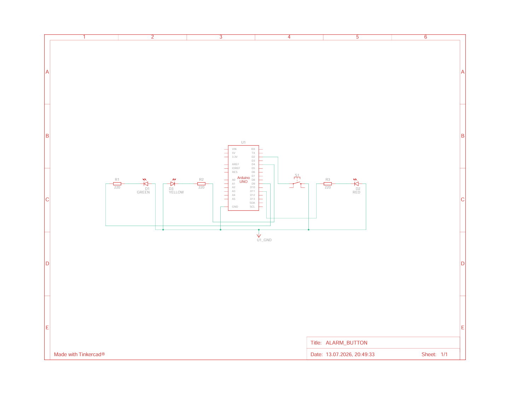
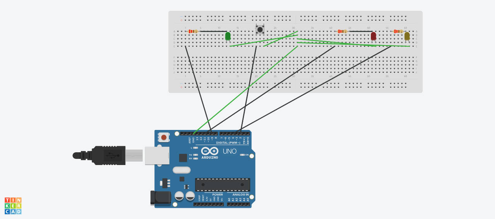

# Arduino Alarm Button

Физическая тревожная кнопка на Arduino, которая при нажатии отправляет уведомление в Telegram через Go-программу на компьютере.

## Как это работает

1. Arduino отправляет строку `ALARM`(или иное сообщение, говорящее о тревоге) через Serial (USB) на компьютер
2. Go-программа ловит строку, делает HTTP POST на Telegram Bot API
3. TelegramBot доставляет push-уведомление получателю
4. Go отправляет обратно `OK` или `FAIL` через Serial
5. Arduino зажигает зелёный(успех) / мигает красным (ошибка) ИЛИ, если не подошли оба варианта, моргает желтым


## Электрическая схема





## Компоненты

| Компонент           | Кол-во |
|---------------------|--------|
| Arduino Uno R3      | 1      | 
| Тактовая кнопка     | 1      | 
| Зелёный светодиод   | 1      | 
| Красный светодиод   | 1      | 
| Жёлтый светодиод    | 1      | 
| Резистор 220 Ом     | 3      | 
| Breadboard          | 1      |
| Перемычки           | 9      | 
| USB-кабель Type-B   | 1      | 


## Индикация

| Светодиод | Поведение     | Значение                                  |
|-----------|---------------|-------------------------------------------|
| Зелёный   | Горит 1 сек   | Сообщение доставлено в Telegram           |
| Красный   | Мигает 3 раза | Ошибка отправки (нет сети/неверный токен) |
| Жёлтый    | Горит 1 сек   | Неизвестный ответ от Go части             |


## Установка

### 1. Прошивка Arduino

1. Откройте `alarm_sketch/alarm_sketch.ino` в Arduino IDE
2. Выберите плату: **Tools → Board → Arduino Uno**
3. Выберите порт: **Tools → Port → ваш COM-порт**
4. Нажмите **Upload**

### 2. Telegram-бот

1. Откройте [@BotFather](https://t.me/BotFather) в Telegram
2. Напишите `/newbot`, следуйте инструкциям
3. Скопируйте полученный токен
4. Получатель тревоги должен найти бота и нажать **Start**
5. Узнайте chat_id — откройте в браузере:
https://api.telegram.org/bot<ТОКЕН>/getUpdates

Найдите `"chat":{"id": ЧИСЛО}` — это ваш chat_id

### 3. Go-часть

```bash
git clone https://github.com/<username>/arduino_alarm.git
cd arduino_alarm
go mod tidy
```

Создайте файл `.env` в корне проекта:

```
TELEGRAM_TOKEN=...
CHAT_ID=...
PORT_NAME=...
```

## Запуск

1. **Arduino IDE** — Upload прошивки
. **VS Code** — `go run .`

## Важные моменты

- Serial Monitor в Arduino IDE должен быть закрыт — порт может использовать только одна программа одновременно
- COM-номер может меняться при переподключении USB — проверяйте в Arduino IDE (Tools → Port)
- Скорость Serial (9600 baud) должна совпадать в прошивке и в Go
